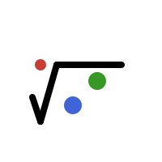

<div align="center">
  
</div>

# RootSolvers.jl

A high-performance root solver package with GPU support and broadcasting across abstract types

RootSolvers.jl provides robust, efficient numerical methods for finding roots of nonlinear equations. It supports broadcasting across abstract types including GPU arrays and custom field types, making it ideal for high-performance computing applications in climate modeling, machine learning, and scientific computing.

|||
|------------------:|:------------------------------------------------------------|
| **Documentation** | [![stable][docs-stable-img]][docs-stable-url] [![dev][docs-dev-img]][docs-dev-url] |
| **Version**       | [![version][version-img]][version-url]                      |
| **License**       | [![license][license-img]][license-url]                      |
| **Tests**         | [![gha ci][gha-ci-img]][gha-ci-url] [![buildkite][bk-ci-img]][bk-ci-url] |
| **Code Coverage** | [![codecov][codecov-img]][codecov-url]                      |
| **Downloads**     | [![Downloads][dlt-img]][dlt-url]                            |

[docs-stable-img]: https://img.shields.io/badge/docs-stable-blue.svg
[docs-stable-url]: https://CliMA.github.io/RootSolvers.jl/stable/

[docs-dev-img]: https://img.shields.io/badge/docs-dev-blue.svg
[docs-dev-url]: https://CliMA.github.io/RootSolvers.jl/dev/

[version-img]: https://juliahub.com/docs/General/RootSolvers/stable/version.svg
[version-url]: https://juliahub.com/ui/Packages/General/RootSolvers

[license-img]: https://img.shields.io/badge/license-Apache%202.0-blue.svg
[license-url]: https://github.com/CliMA/RootSolvers.jl/blob/main/LICENSE

[gha-ci-img]: https://github.com/CliMA/RootSolvers.jl/actions/workflows/OS-UnitTests.yml/badge.svg
[gha-ci-url]: https://github.com/CliMA/RootSolvers.jl/actions/workflows/OS-UnitTests.yml

[bk-ci-img]: https://badge.buildkite.com/a1adc87fee91767e80a581176c8dec4f73055455d2e94c8147.svg?branch=main
[bk-ci-url]: https://buildkite.com/clima/rootsolvers-ci/builds?branch=main

[codecov-img]: https://codecov.io/gh/CliMA/RootSolvers.jl/branch/main/graph/badge.svg
[codecov-url]: https://codecov.io/gh/CliMA/RootSolvers.jl

[dlt-img]: https://img.shields.io/badge/dynamic/json?url=http%3A%2F%2Fjuliapkgstats.com%2Fapi%2Fv1%2Ftotal_downloads%2FRootSolvers&query=total_requests&label=Downloads
[dlt-url]: https://juliapkgstats.com/pkg/RootSolvers

## Features

- **Multiple Root-Finding Methods**: Secant, Regula Falsi, Brent's method, Newton's method with automatic differentiation
- **GPU Support**: Full GPU acceleration with CUDA.jl and other GPU array types
- **Broadcasting**: Allows broadcasting over distributed arrays and custom field types
- **Dual Number Support**: Compatible with automatic differentiation frameworks, allowing integration into differentiable models
- **Flexible Convergence Criteria**: Multiple tolerance types for different applications
- **High-Performance**: Optimized for large-scale parallel processing

## Quick Example

```julia
using RootSolvers

# Simple scalar root finding
sol = find_zero(x -> x^2 - 4, SecantMethod(0.0, 3.0))

# Broadcasting over arrays
x0 = rand(100, 100)
x1 = rand(100, 100)
f(x) = x.^2 .- 2.0
sol = find_zero.(f, SecantMethod(x0, x1), CompactSolution())
```

## Contributing

Contributors should follow the shared CliMA engineering standards in [`docs/dev-guides/`](docs/dev-guides/), which cover architecture, performance, code quality, documentation, and workflows. These are vendored from [CliMA/DeveloperGuides](https://github.com/CliMA/DeveloperGuides). The repo's [`AGENTS.md`](AGENTS.md) is a starting point for AI agents with repo-specific guidance.
